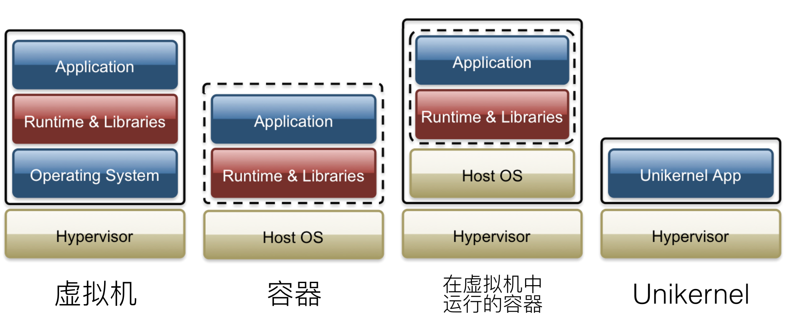

# Unikernel 项目重要性分析

###比Docker好在哪？

Unikernel，Docker 二者经常被拿来相提并论。它们的主要意义都是用来替换云计算中使用传统虚拟机这一过于臃肿和有时不太安全的解决方案，但两者的区别非常明显。

Docker 为云计算的操作系统提供了相较传统虚拟机一个更轻量级的选择。在很多方面，Docker 下的容器与虚拟机非常相似。它们都旨在为运行代码提供一个能支持代码运行的独立稳定的环境。最大的区别是 Docker 通过分享来减少重复。Docker 可以共享主机环境的 Linux 内核，也可以共享操作系统的其余部分，甚至它们还可以共享除应用程序代码和数据之外的所有内容。例如，我可以使用容器在同一台物理机器上运行两个博客。这两个容器可以设置为共享除模板文件，媒体上传和数据库之外的所有内容。借助一些复杂的文件系统技巧，每个容器都可以“认为”它具有专用的文件系统。

Docker 还有另外的易于移植的特性，将程序运行所需的环境直接封装入容器中就可以保证程序在不同的计算机的 Docker上 正常运行。

而 Unikernel 对于 Docker 有独特的优势。

Unikernel 为了实现体量的缩小，选择了与Docker完全不同的路线。它只专注于一个目标程序，没有其它冗余的程序和支持，没有多进程切换，所以系统很小也很简单。虽然 Docker 容器的 image 比传统的虚拟机(以G计)要小很多，但是一般也是好几百兆，而 unikernel 由于不包含其它不必要的程序和服务(ls,echo,cd,tar等)，甚至没有Shell，所以体积非常小，通常只有几兆甚至可以更小。比如 mirageOS 的示例 mirage-skeleton 编译出来的 xen 虚拟机只有 2M。体量的缩小也使得Unikernel的启动和运行的速度相较 Docker 有明显的提高。

另外，Unikernel 没有其它不必要的程序，使其受到漏洞攻击的可能性大大降低，docker 里面虽然大多数情况只跑一个程序，但是里面含有其它 coreutils，只要其中任何一个有安全漏洞，整个服务可能就会受到攻击。而Unikernel 中没有 Shell 可用，没有密码文件，没有多余的设备驱动，只有少数功能可以利用，这严重限制了未经授权的用户可能造成的破坏。另一方面，对于Unikernel而言，每一个操作系统都是定制用途的，其中包含的核心库均不相同，即使某个服务构建的操作系统由于特定软件问题而遭到入侵，同样的入侵手段在其他的服务中往往不能生效。这无形中增加了攻击者利用系统漏洞的成本。

Unikernel System，一个知名 Unikernel 开发研究组织在2016年一月被Docker收购。作为当下最流行的应用容器引擎服务的提供商，Docker 这一收购足以说明 Docker 对于 Unikernel 的重视。

### 我们对于 Unikernel 能怎样有所作为？

由于 Unikernel 的结构组成的特殊性，一些程序想要移植到 Unikernel 上往往需要将代码完全重写，这一定程度影响了可移植性。而且 Unikernel 并不是传统的程序，开发和测试都与传统的有不小的差别，造成了开发难度的增大。

在开发过程中，开发者可以在传统的操作系统上进行开发，而所有内核相关的功能，暂且由开发机的操作系统提供。

而在测试环境中，大部分 Unikernel 的实现会将应用代码与需要的内核模块构建成 Unikernel 后，再将其跑在一个传统的操作系统上，利用传统操作系统上的工具来测试 Unikernel。以 [Rumprun](https://link.zhihu.com/?target=https%3A//github.com/rumpkernel/rumprun)为例，它可以通过 KVM / QEMU 来运行一个 Rumprun Unikernel VM，随后用 Host OS 上的 GDB 来对其进行调试，这跟我们实验中测试内核的步骤比较相似，那么我们在实验中对于内核调试的种种遗憾，如调试器容易有 bug，编译调试步骤繁琐，命令或者说功能不够丰富科学等等，也可以投影到 Unikernel 的开发调试上。联想诸如 Pycharm ，Vs Studio 这些成熟的 IDE，它们丰富的调试辅助功能，对开发效率的提高是非常显著的，也变相地降低了编程开发测试的难度，降低了编程的门槛，促进了语言的普及。那么，如果我们对于 Unikernel 的测试环境能有所改进，小到改进 debugger 一些缺点，大到开发一个相应的 IDE，就可能为促进 Unikernel 的实用化和普及，创建一个更高效的云计算世界做出一份贡献。这正是我们想要做的。

